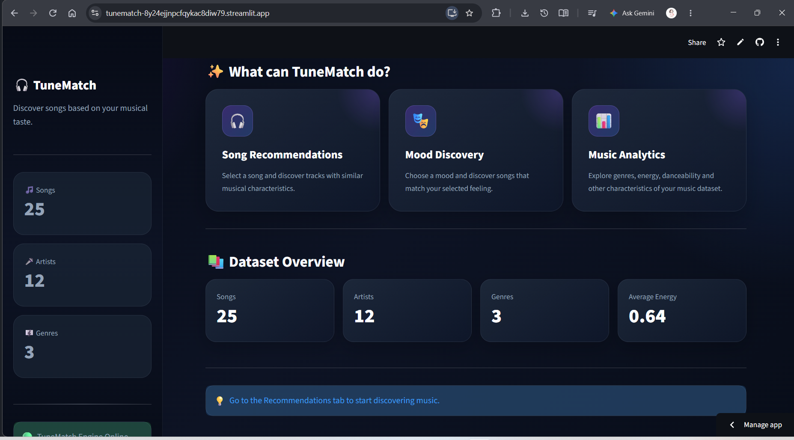
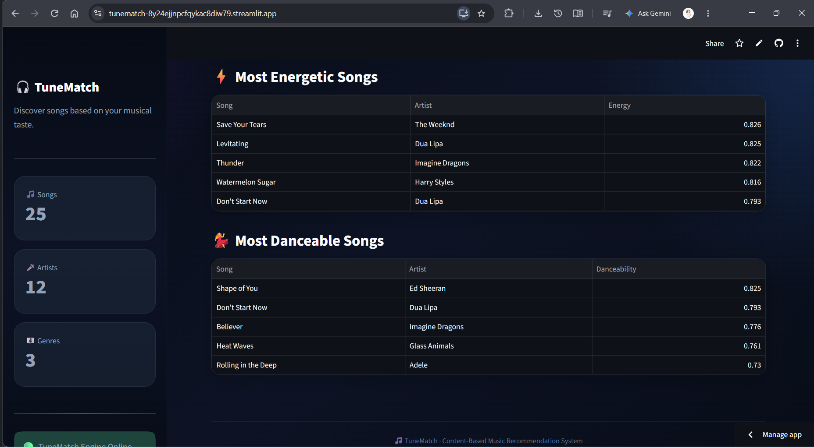

# 🎵 TuneMatch — Personal Music Discovery Engine

<p align="center">

  
  
  
  
  

</p>

<p align="center">

### 🎧 Discover music that matches your taste, mood, and listening personality.

A content-based music recommendation system built with **Python, Streamlit, Pandas, and Scikit-learn**.

<p align="center">

🚀 **[Live Demo](https://tunematch-8y24ejjnpcfqykac8diw79.streamlit.app/)**

</p>

---

## 📌 Overview

**TuneMatch** is an interactive music discovery application that recommends songs based on their musical characteristics.

Instead of relying on user-to-user listening history, TuneMatch uses a **content-based recommendation approach** to compare songs using audio features such as:

* ⚡ Energy
* 💃 Danceability
* 🎹 Acousticness
* 🎼 Instrumentalness
* 😊 Valence

The application combines recommendation algorithms, data analysis, visualization, playlist management, and an interactive Streamlit interface into one complete project.

---

## ✨ Features

### 🎧 Personalized Recommendations

Select a song and discover tracks with similar musical characteristics.

You can:

* Search songs by title or artist
* Filter recommendations by genre
* Choose the number of recommendations
* Sort by similarity
* Sort by energy
* Sort by danceability
* Sort by valence
* Sort by release year

---

### 🎭 Mood-Based Discovery

Choose a mood and receive music recommendations that match it.

| Mood          | Description                  |
| ------------- | ---------------------------- |
| 😌 Chill      | Calm and relaxing tracks     |
| ⚡ Energetic   | High-energy music            |
| 💃 Dance      | Dance-oriented tracks        |
| 😊 Happy      | Positive and uplifting music |
| 💔 Melancholy | Emotional and mellow tracks  |

---

### ❤️ My Playlist

Create and manage a personal playlist directly inside TuneMatch.

Features include:

* ❤️ Add songs
* 🗑️ Remove songs
* 💾 Save playlist
* 📥 Export playlist as CSV
* 🔄 Persistent playlist storage

---

### 👤 My Profile

TuneMatch analyzes the songs saved in your playlist and generates a personalized music profile.

It includes:

* 🎼 Favorite genre
* ⚡ Average energy
* 💃 Average danceability
* 🎹 Average acousticness
* 😊 Average valence
* 🎭 Music personality

---

### 📊 Music Analytics

Explore insights from the music dataset through interactive visualizations.

Analytics include:

* 🎼 Genre distribution
* ⚡ Average energy by genre
* 💃 Average danceability by genre
* 😊 Average valence by genre
* 📅 Songs by release year
* ⚡ Most energetic songs
* 💃 Most danceable songs

---

## 🧠 How the Recommendation System Works

TuneMatch uses a **content-based recommendation system**.

The basic workflow is:

```text
                 User selects a song
                         │
                         ▼
              Extract audio features
                         │
                         ▼
                Standardize features
                         │
                         ▼
              Calculate similarity
                         │
                         ▼
            Rank similar songs
                         │
                         ▼
       Apply optional genre/filtering
                         │
                         ▼
            🎵 Recommendations
```

The recommendation engine compares the numerical audio characteristics of songs and identifies tracks with similar musical profiles.

This approach uses **feature similarity rather than collaborative user history**.

---

## 🛠️ Tech Stack

| Technology      | Purpose                                     |
| --------------- | ------------------------------------------- |
| 🐍 Python       | Core programming language                   |
| 🎨 Streamlit    | Interactive web application                 |
| 🐼 Pandas       | Data loading and analysis                   |
| 🔢 NumPy        | Numerical operations                        |
| 🤖 Scikit-learn | Feature scaling and similarity calculations |
| 📊 Matplotlib   | Data visualization                          |
| 📄 CSV          | Music dataset and playlist storage          |

---

## 📸 Screenshots

### 🏠 Home


---

### 🧭 Navigation



---

### 🎵 Recommendations


---

### 😊 Mood Recommendations


---

### 📊 Analytics



---

## 📂 Project Structure

```text
TuneMatch/
│
├── app.py
├── recommender.py
├── requirements.txt
├── README.md
├── LICENSE
│
├── data/
│   └── songs.csv
│
└── screenshots/
    ├── home.png
    ├── navigation.png
    ├── recommendations.png
    ├── mood.png
    └── analytics.png
```

---

## 🚀 Getting Started

### 1. Clone the repository

```bash
git clone https://github.com/Priyanshi00Goyal/TuneMatch.git
```

### 2. Navigate to the project

```bash
cd TuneMatch
```

### 3. Create a virtual environment

```bash
python -m venv venv
```

### 4. Activate the virtual environment

### Windows

```bash
venv\Scripts\activate
```

### macOS / Linux

```bash
source venv/bin/activate
```

### 5. Install dependencies

```bash
pip install -r requirements.txt
```

### 6. Run the application

```bash
streamlit run app.py
```

The application will open in your browser.

---

## 📋 Requirements

The project uses:

```text
pandas
numpy
scikit-learn
streamlit
matplotlib
```

These dependencies are already defined in `requirements.txt`.

---

## 🎯 Project Goals

TuneMatch was created to explore how data science and recommendation algorithms can be combined with an interactive user interface to create a practical music discovery experience.

The project focuses on:

* Data analysis
* Feature engineering
* Similarity-based recommendations
* Interactive visualization
* User-focused application design
* Python application development

---

## 🔮 Future Improvements

Potential future improvements include:

* 🎵 Larger music dataset
* 🧠 More advanced recommendation algorithms
* 🤖 Machine-learning-based personalization
* 🎶 Spotify API integration
* 🔐 User authentication
* ☁️ Cloud-based playlist storage
* 📱 Improved mobile responsiveness
* 🎯 More personalized recommendation explanations

---

## 👩‍💻 Author

**Priyanshi Goyal**

B.Tech CSE Student | Python Developer | Aspiring AI/ML & Full-Stack Developer

### Connect with me

* 💻 [GitHub](https://github.com/Priyanshi00Goyal)
* 💼 [LinkedIn](https://www.linkedin.com/in/priyanshi-goyal-a72b42379/)
* 🧩 [LeetCode](https://leetcode.com/u/Priyanshi00/)

---

## 📄 License

This project is licensed under the **MIT License**.

---

<p align="center">

### 🎧 Find your sound. Discover your match. 🎵

**Built with Python, data, and a love for music.**

</p>
